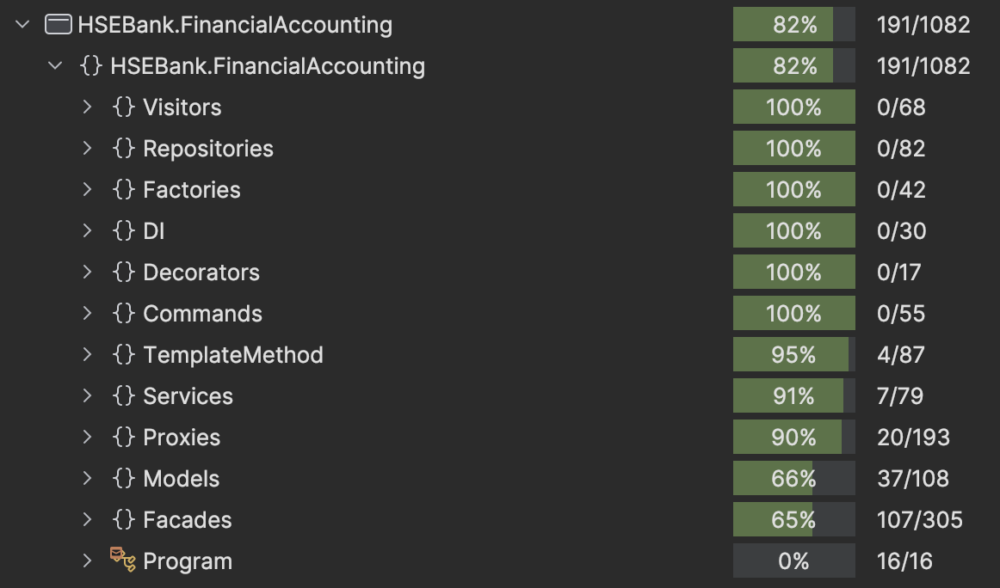

# HSE Bank

## Реализовано
1. **Основной функционал банковских аккаунтов**
   - Создание, просмотр, изменение и удаление банковских аккаунтов, весь функционал можно найти в **IBankAccountFacade**
   - Удаление и изменение меняет только локально класс для каскадного изменения стоило бы добавить бд, для этого можно сделать класс-наследник **IBankAccountRepository**

2. **Основной функционал категорий**
   - Создание, просмотр, изменение и удаление категорий, весь функционал можно найти в **IBankCategoryFacade**
   - Удаление и изменение меняет только локально класс для каскадного изменения стоило бы добавить бд, для этого можно сделать класс-наследник **ICategoryRepository**

3. **Основной функционал операций**
   - Создание, просмотр, изменение и удаление операций, весь функционал можно найти в **IOperationFacade**
   - Удаление и изменение меняет только локально один объект для каскадного изменения стоило бы добавить бд, для этого можно сделать класс-наследник **IOperationRepository**

4. **Аналитика**
   - Подсчет разницы доходов и расходов, а также сами доходы и расходы за выбранный период по конкретному банковскому аккаунта или по всем сразу
   - Посмотреть сгруппированную по категориям разницу между доходами и расходами
   - Весь функционал можно найти в **IAnalyticsFacade**

5. **Импорт и экспорт данных**
   - Импорт и экспорт всех данных в формат JSON
   - Тут можно добавлят новые классы для новых форматов: CSV, XML и т.д. унаследовавшись от **DataImporter**.

6. **Статистика**
   - Замеряется и логируется время выполнение каждой команды с помощью соответсвующего декоратора

## Структура проекта
1. **HSEBank.FinancialAccounting** - Проект, в котором реализован весь требуемый функционал
2. **HSEBank.FinancialAccounting.Tests** - Проект, который отвечает за тестирование проекта **HSEBank.FinancialAccounting**

## Используемые шаблоны проектирования

### Порождающие шаблоны
1. **Фабричный метод** - Используется для создания доменных объектов (BankAccount, Category, Operation) для обеспечения корректной валидации и инкапсуляции.

### Структурные шаблоны
1. **Фасад** - Используется для предоставления понятного интерфейса для множества классов (BankAccountFacade, CategoryFacade, OperationFacade, AnalyticsFacade).
2. **Прокси** - Используется для реализации кэширования репозиториев (CachedBankAccountRepository, CachedCategoryRepository, CachedOperationRepository).
3. **Декоратор** - Используется для замера времени выполнения команд (CommandTimingDecorator).

### Поведенческие шаблоны
1. **Команда** - Используется для инкапсуляции операций как объектов (CreateBankAccountCommand, CreateCategoryCommand, CreateOperationCommand).
2. **Шаблонный метод** - Используется для импорта данных различного формата (DataImporter, JsonDataImporter).
3. **Посетитель** - Используется для экспорта данных в различные форматы (IDataExportVisitor, JsonDataExportVisitor).

## Реализация принципов SOLID

1. **Принцип единственной ответственности (SRP)**
   - Каждый класс имеет единственную ответственность (например, репозитории отвечают за доступ к данным, фасады обрабатывают бизнес-логику и т.д.)

2. **Принцип открытости/закрытости (OCP)**
   - Система открыта для расширения, но закрыта для модификации (например, новые форматы данных могут быть добавлены без изменения существующего кода)

3. **Принцип подстановки Лисков (LSP)**
   - Производные классы могут быть подставлены вместо своих базовых классов (например, CachedBankAccountRepository может использоваться везде, где ожидается IBankAccountRepository)

4. **Принцип разделения интерфейса (ISP)**
   - Интерфейсы не божественные, то есть предоставляют довольно понятно ограниченный набор функций (например, отдельные интерфейсы для различных типов репозиториев)

5. **Принцип инверсии зависимостей (DIP)**
   - Высокоуровневые модули зависят от абстракций, а не от конкретных реализаций (например, фасады зависят от интерфейсов репозиториев, а не от конкретных реализаций)

## Реализация принципов GRASP

1. **High Cohesion**
   - Классы имеют тесно связанные обязанности (например, BankAccountFacade обрабатывает только операции, связанные с банковскими счетами)

2. **Low Coupling**
   - Классы имеют минимальные зависимости от других классов (например, использование интерфейсов вместо конкретных реализаций)

Важность этих принципов в том, что после их применения становится намного проще покрывать тестами написанный код, поддерживать и расширять код, так как изменения требуется вносить только в новые файлы, а уже существующие классы остаются без изменений, таким образом уже написанный и проверенный код остаётся рабочим.

Проект разлелён на 3 уровня:
   - Уровень представления (ConsoleUI)
   - Уровень бизнес-логики (Фасады и сервисы)
   - Уровень данных (Репозитории)

## Инструкция по запуску проекта
1. Установите .NET 9+
2. Перейдите в директорию `HW-BANK`, где находится файл `HSEBank.FinancialAccounting.csproj`
3. Выполните в терминале: \
   `dotnet run`

## Покрытие тестами без учёта ConsoleUI

